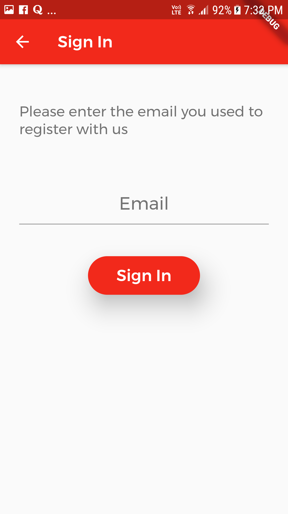
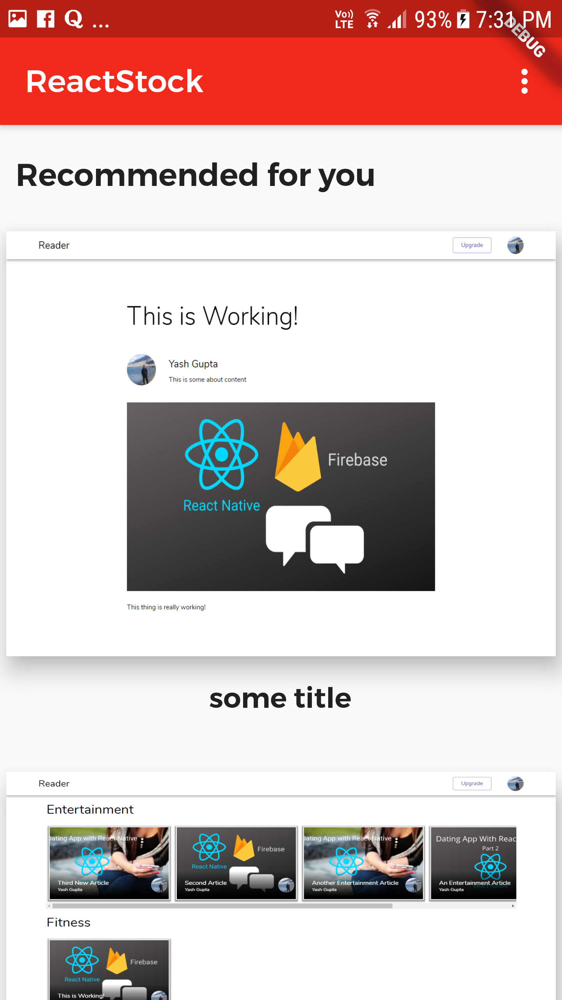
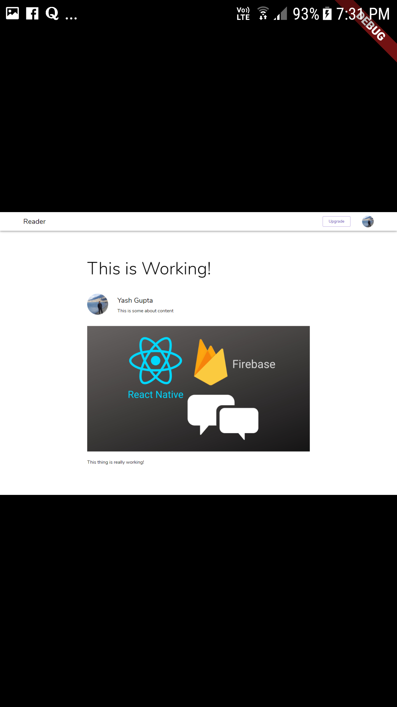
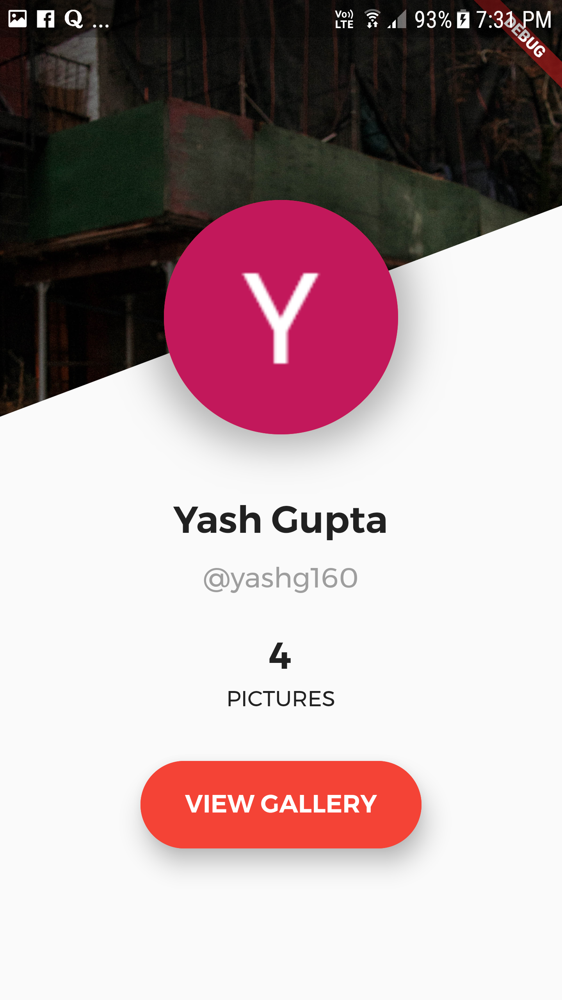

# ReactStock Flutter

#### A Flutter based cross-platform app built for my previous project, [ReactStock](https://github.com/yashg160/ReactStock), where users can share random photographs with each other.

### Technical Details

The app is built with **Flutter**, using Dart language and is fully cross-platform, supporting both iOS and Android platforms. Technologies used:

1. Flutter
2. Dart
3. UI / UX

The server for the project was simply the **backend** branch of the ReactStock project, which you can check [here](https://github.com/yashg160/ReactStock/tree/Backend).

:boom: **Screenshots** :boom:

